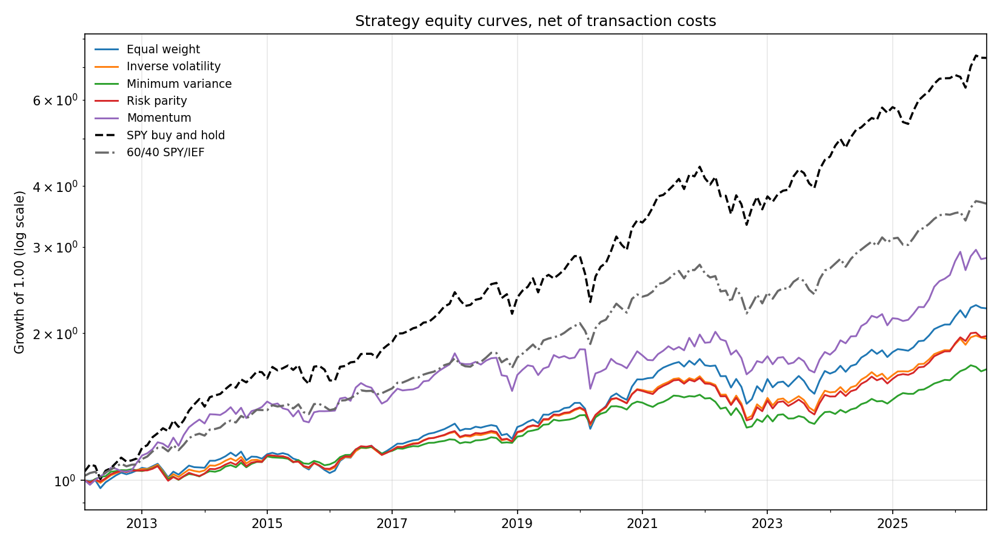
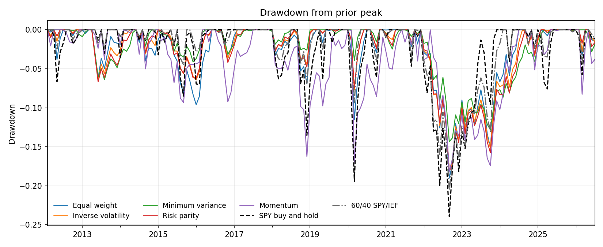

# Multi-Strategy Portfolio

A quantitative research framework for building, backtesting, and combining systematic trading strategies under a shared risk and portfolio construction layer.

The goal is separation of concerns. Data loading, signal generation, portfolio construction, and performance measurement are independent modules. Any strategy that produces a weight vector can be dropped into the same backtest engine and compared on identical terms.

---

## Contents

- [Design](#design)
- [Repository Layout](#repository-layout)
- [Strategies](#strategies)
- [Portfolio Construction](#portfolio-construction)
- [Backtest Methodology](#backtest-methodology)
- [Installation](#installation)
- [Usage](#usage)
- [Results](#results)
- [Limitations](#limitations)
- [License](#license)

---

## Design

Every strategy implements the same interface:

```python
def weights_fn(returns: pd.DataFrame, date: pd.Timestamp, **params) -> pd.Series:
    """Return target portfolio weights for `date` using only data available at `date`."""
```

The engine handles rebalancing, transaction costs, and performance attribution. This means a new strategy requires one function, not a new backtester.

```
Data Layer  ->  Signal Layer  ->  Portfolio Construction  ->  Backtest Engine  ->  Reporting
```

---

## Repository Layout

```
multi-strategy-portfolio/
|
|-- README.md
|-- LICENSE
|-- .gitignore
|-- requirements.txt
|
|-- src/
|   |-- __init__.py
|   |-- backtest.py
|   |-- optimizer.py
|   |-- portfolio.py
|   `-- risk.py
|
|-- strategies/
|   |-- __init__.py
|   |-- macro.py
|   |-- momentum.py
|   |-- sector_rotation.py
|   `-- stat_arb.py
|
|-- docs/
|   |-- methodology.md
|   `-- roadmap.md
|
|-- results/
|   `-- .gitkeep
|
|-- tests/
|   |-- __init__.py
|   |-- test_backtest.py
|   |-- test_optimizer.py
|   `-- test_risk.py
```

---

## Strategies

| Strategy | Signal | Universe | Rebalance |
|---|---|---|---|
| Cross-sectional momentum | 12 month return skipping the most recent month | Equity | Monthly |
| Mean reversion | Z-score of price against a rolling mean | Equity | Weekly |
| Risk parity | Inverse volatility contribution | Multi-asset ETF | Monthly |
| Minimum variance | Ledoit-Wolf shrunk covariance | Equity | Monthly |
| Sentiment overlay | FinBERT score on financial text | Sector ETF | Monthly |

Fill in or trim this table to match what is actually in `strategies/`.

---

## Portfolio Construction

Available weighting schemes:

- **Equal weight** — baseline with no estimation error
- **Mean variance** — Markowitz optimization with optional long-only and turnover constraints
- **Minimum variance** — Ledoit-Wolf shrinkage on the covariance matrix to reduce estimation noise
- **Risk parity** — equal marginal risk contribution, solved numerically
- **Inverse volatility** — simple risk-based scaling

Shrinkage matters here. Sample covariance matrices are badly conditioned when the number of assets approaches the number of observations, and the optimizer will load onto whatever the estimation error favors. Ledoit-Wolf pulls the estimate toward a structured target and produces materially more stable weights out of sample.

---

## Backtest Methodology

- **Walk-forward only.** Parameters are estimated on a trailing window and applied forward. No in-sample fitting.
- **Point-in-time universe.** Constituents reflect membership as of the rebalance date to avoid survivorship bias.
- **Transaction costs.** Applied per unit of turnover at each rebalance.
- **Lagged signals.** Signals computed at close on date `t` are traded at `t+1` open.

| Parameter | Default |
|---|---|
| Backtest window | 2000-01-01 to 2025-12-31 |
| Estimation window | 60 months |
| Rebalance frequency | Monthly |
| Transaction cost | 10 bps per side |

---

## Installation

```bash
git clone https://github.com/graysonsking/multi-strategy-portfolio.git
cd multi-strategy-portfolio

python -m venv .venv
source .venv/bin/activate        # Windows: .venv\Scripts\activate

pip install -r requirements.txt
```

---

## Usage

Reproduce every published number with one command:

```bash
python run_results.py
```

This downloads the universe from Yahoo Finance, caches it to `cache/`, runs all
five strategies and both benchmarks on an identical schedule, and writes
`results/summary.csv`, `results/summary.md`, and the two figures under
`docs/images/`.

Verify the pipeline without a network first:

```bash
python run_results.py --offline
```

Override the defaults for sensitivity work:

```bash
python run_results.py --start 2010-01-01 --cost-bps 25
```

All settings live in `config.py`: universe, sample window, estimation window,
cost rate, optimizer parameters, and the benchmark definitions. Edit that file
rather than the runner.

Use the engine directly:

```python
import pandas as pd
from src.backtest import Backtester
from strategies.momentum import weights_fn

bt = Backtester(
    asset_returns=monthly_returns,   # DataFrame, DatetimeIndex
    lookback=60,
    rebalance="ME",
    cost_bps=10,
)

result = bt.run(lambda r, d: weights_fn(r, d, top_n=4))
print(result.summary())
```

---

## Tests

```bash
python -m pytest tests -q
```

27 tests covering the look-ahead guard, optimizer constraints, covariance conditioning, and cost accounting.

## Results

Every number below is produced by `python run_results.py`. Full statistics and
the complete parameter set are written to
[results/summary.md](results/summary.md) on each run.

**Trading period 2012-02 to 2026-07.** Monthly rebalance, 60-month trailing
estimation window, 10 bps one-way transaction costs charged on turnover. The
data sample begins 2007-02; the first 60 months are the estimation burn-in and
are excluded from every statistic. Benchmarks are measured over the identical
window and pay the identical cost schedule, so the 60/40 blend is charged for
its monthly rebalancing rather than getting it free.

| Strategy | CAGR | Volatility | Sharpe | Max Drawdown | Beta | Avg Turnover |
|---|---|---|---|---|---|---|
| Equal weight | 5.75% | 8.56% | 0.70 | -19.02% | 0.50 | 0.00 |
| Inverse volatility | 4.71% | 7.03% | 0.69 | -18.06% | 0.38 | 0.01 |
| Minimum variance | 3.67% | 5.20% | 0.72 | -14.35% | 0.21 | 0.02 |
| Risk parity | 4.80% | 7.03% | 0.70 | -18.07% | 0.36 | 0.02 |
| Momentum | 7.49% | 11.66% | 0.68 | -18.18% | 0.59 | 0.18 |
| **SPY buy and hold** | **14.71%** | **14.01%** | **1.05** | **-23.93%** | — | 0.00 |
| **60/40 SPY/IEF** | **9.40%** | **8.94%** | **1.05** | **-20.51%** | 0.61 | 0.01 |





### Findings

This is a negative result. None of the five weighting schemes beat either
benchmark on any risk-adjusted measure. Information ratios against SPY run
from -0.68 to -1.04.

**A two-asset blend dominated at matched volatility.** Equal weight ran at
8.56% volatility and returned 5.75%. A 60/40 SPY/IEF portfolio ran at 8.94%
volatility, statistically the same risk, and returned 9.40%. Sharpe 0.70
against 1.05. Twelve asset classes, a Ledoit-Wolf shrinkage estimator, and a
constrained optimizer produced 3.65 points a year less than two tickers and a
rebalance rule.

**The choice of weighting scheme barely mattered.** Sharpe ratios of 0.70,
0.69, 0.72, 0.70, and 0.68 across five methods. That spread is noise. Universe
selection dominated optimizer selection completely, which is the opposite of
where the modelling effort went.

**The risk reduction was real but poorly priced.** Minimum variance did post
the lowest drawdown at -14.35%, and that is a genuine result. But it ran at
5.20% volatility against 60/40's 8.94%. Scaling it naively to matched
volatility, ignoring borrowing cost, implies roughly 6.3% CAGR and a drawdown
near -25%: worse than 60/40 on both counts. The shallower drawdown was bought
by holding less risk, not by diversifying better.

**Diversification failed in the one period it was needed.** The drawdown chart
separates two stress events cleanly. In early 2020 SPY fell about -19.5% while
the strategies held near -10%, because bonds rallied as equities sold off. In
late 2022 the same portfolios converged with the benchmark: SPY -23.93%, 60/40
-20.51%, strategies -18% to -19%. 2022 was a joint stock and bond selloff, and
correlation-based diversification has nothing to offer when the diversifiers
fall together. The protection was available when it was cheap and absent when
it was expensive.

**Low betas explain the return gap.** Realised betas to SPY ran 0.21 to 0.59.
Over a period when US large cap compounded at 14.71%, these portfolios were
structurally underweight the asset doing the work. Minimum variance sat at 0.21
beta with 4.57 effective holdings, meaning shrinkage plus the 30% position cap
pushed it almost entirely into duration for fourteen years.

**Momentum's advantage is leverage, not alpha.** It earned the highest strategy
return at 7.49% and the best Calmar at 0.41, but it ran 11.66% volatility
against equal weight's 8.56%. Its Sharpe was already lower at 0.68 versus 0.70,
and a cost sweep widens the gap: at 25 bps 0.65 versus 0.70, at 50 bps 0.61
versus 0.69. Scaling equal weight to matched volatility implies roughly 7.83%
CAGR at 10 bps, above momentum's actual 7.49%. The raw return advantage
survives to roughly 90 bps one-way; the risk-adjusted advantage never existed.

The sweep also isolates cost sensitivity. Moving from 10 to 50 bps costs
momentum 0.90 points of CAGR and equal weight 0.02, a 45x difference driven by
216% annualised turnover. Both benchmarks are effectively unaffected.

### What this does not show

The result is specific to one regime. 2012 to 2026 contained an exceptional US
equity run and a single joint stock-bond drawdown. It is close to a worst case
for multi-asset diversification, and a sample containing 2000-2002 or 2008
would very likely reverse the ranking. This is evidence about a period, not a
verdict on portfolio construction.

---

## Limitations

- **Single regime.** The trading period is 2012-02 to 2026-07, an exceptional
  US equity run containing one joint stock-bond drawdown. A sample spanning
  2000-2002 or 2008 would plausibly reverse the ranking.
- **Survivorship and selection.** The universe is a fixed list of twelve ETFs
  that all exist today with long histories. That is itself a filter, applied
  with hindsight, and it flatters the results.
- **Cost model.** A flat bps charge on turnover ignores bid-ask spread, market
  impact, and the fact that costs differ materially across asset classes.
  Momentum is the line most exposed to this assumption.
- **No borrowing or leverage.** Weights are long-only and sum to one, so the
  volatility-matched comparison in the results section is arithmetic rather
  than something the framework can actually execute.
- **Capacity is not modelled.** Nothing here accounts for the size at which
  these strategies would move the assets they trade.

---

## License

MIT. See [LICENSE](LICENSE).

---

*This repository is research code. It is not investment advice and is not intended for live trading.*
